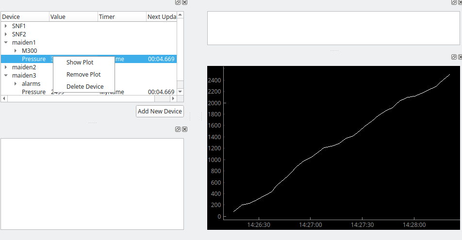
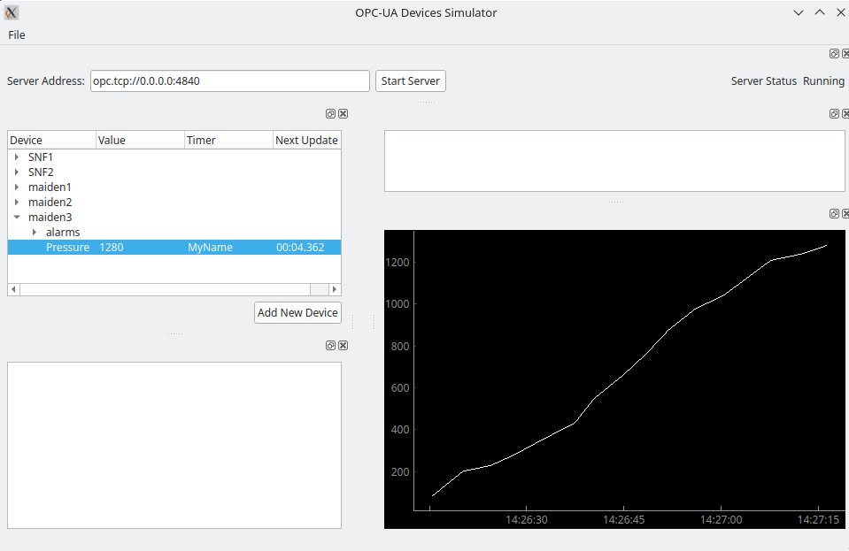

# How To Run
After all the required packages have been installed, type 
```python
python mainwindow.py
```
or
```python
python3 mainwindow.py
```
in your favorite terminal. 
# Quick Introduction
The default starting address is opc.tcp://0.0.0.0:4840. This can be easily changed by
typing a new address in the Server Address line. The program will not let you add
any devices until the server has been started.


Click "Start Server" to start the OPC UA server.
The "Server Status" will change from "Not Running" to "Running" if the server has been
stared successfully.


You can add devices by using the "File" menu item at the top and then selecting "Add
Directory" or "Add File." See the "Device XML Structure" if you'd like
to try to make your own from scratch. There is also "test_file_2.xml" in the
devices_and_timers folder as an example.

If you have successfully imported files, you should see the devices listed in the
tree on the left hand side.


Newest version now has the option of displaying plots for historized
variables:



This screenshot shows a RampRandom variable plotted:



If you have added the server to your Ignition Gateway, you can see it listed in 
the OPC browser.


You can drag and drop the items into your tags folder


# Timers
Each variable in the program has a timer associated with it. A timer fires either
after a set amount of time every time, called *periodic*, or a random amount of time
between give low and high values called *random.*

When a timer fires, it evaluates all functions that are associated with it.

For example, a random timer with min 2.5 and max 80, can be called at any 
values between 250 ms and 80,000 ms. A periodic timer with timeout set to 2 will fire
every 2 seconds.

# Functions
Every variable has function defined for it. The following list are all the 
available functions for variables. There are plans to add more functions.

Every function has a "repeat" and a "historize" in its XML definition.
* repeat = True means repeat indefinitely, False means stop after period
* historize = True means to keep a history of values. Current max time of keeping
history is 2 hours. This can be changed by editing the following line in
value_function_classes.py:
```python
    self.number_of_history_hours = 2
```

## ValueList
This function takes a list of values and then iterates through the list in order.
The function can iterate through a set number of times or indefinitely.
### Example
[1, 3, 2, 4, 6], Period = 3, Repeat = False: This would cause the variable to take 
on the values 1, 3, 2, 4, 6, 1, 3, 2, 4, 6, 1, 3, 2, 4, 6 and then stop on 6. 
Having Repeat=True discards any value period
### XML Function Element
* values = list of values the variable will take; note that the order given is the
order the variable will use
* period = number of times to repeat; NOTE: This is different than most other 
functions in that this is not True/False, but an integer.

## WeightedList
This function takes a random sample from a list created from a value and weight lists.
If the values is [v_1, v_2, ..., v_n] and the weight list is [w_1, w_2, ..., w_n], 
then the random sample is take from w_1 copies of v_1, w_2 copies of v_2, ..., 
and w_n copies of v_n. Note that the weight list must be integers.
### Example
values = [1, 4, 5] and weights = [9, 2, 1]. The random sample is taken from
[1, 1, 1, 1, 1, 1, 1, 1, 1, 4, 4, 5]. Thus the probability of 1 is 3/4, probability
of 4 is 1/6, and 5 is 1/12.
### XML Function Element
The XML function element "weightedlist" must contain:
* type = 'weightedlist'
* values = list of values in brackets [] (might have a different name in your 
country)
* weights = list of values in brackets [] (might have a different name in your 
country)
* period = number of times the random sample should be taken; if repeat set to 
True, random sample will be taken indefinitely

## RampStep
The variable increments the same given value every time its associated timer
fires. Once the variable reaches its maximum, it will reset to the given 
minimum.
### XML Function Element
* type = 'rampstemp'
* min = minimum value the variable should take
* max = maximum value the variable should reach
* step = amount to increment each time its associated timer fires

## RampPeriodic
The amount the variable increments depends on the elapsed time between when its 
associated timer fires. For periodic timers, the amount incremented will be the
same. However for random timers, the increment value will differ. This ensures
that the variable will reach its maximum every period. In contrast, the 
RampRandom has no period and thus not guaranteed to reach its maximum in any
given time frame.
### Example
Take minimum = 200, maximum = 10,000, period = 440, and has a periodic timer set to
fire every 10 secs. The variable will then increment by around 223 each time the
timer fires.
### XML Function Element
* type = 'rampperiodic'
* min = minimum value the variable should take
* max = maximum value the variable should reach
* period = number of seconds for the ramp to repeat


## RampRandom
Randomly increments by a value in an interval. If the value is above the given
maximum, it will start over at the minimum.

## Square
The variable will take on one of two values given by min and max. Period is the
minimum number of seconds the variable should stay at a value before switching. 
### XML Function Element
* type = 'square'
* min = The value the variable will take on first.
* max = The value the variable will take on second. Note that max can be less than
min.
* period = Minimum number of seconds the variable should stay at each value.

## RandomSquare
Randomly takes on one of two given values.
### XML Function Element
* type = 'randomsquare'
* min = one possible value the variable will take
* max = the other possible value the varialbe will take
* period = number of seconds the function should spend switching between
min and max; if repeat is set to true, this has no purpose

## Triangle
Makes a sawtooth function that oscillates between min and max.
### XML Function Element
* type = 'triangle'
* min = minimum value the variable should take
* max = maximum value the variable should take
* period = number of seconds in which one tooth is made

## Sin
Makes use of the sin function. 
### XML Function Element
* type = 'sin'
* min = minimum value the variable should take
* max = maximum value the variable should take
* period = number of seconds in which one period of the sine function is executed

## Cos
Makes use of the cos function.
### XML Function Element
* type = 'cos'
* min = minimum value the variable should take
* max = maximum value the variable should take
* period = number of seconds in which one period of the cosine function is executed

# Device XML Structure
The base tag is "simulator." The sub-element "timers" contains all the definitions
for timers that are to be used for the variables.

The next sub-elements are "device." There can be 1 or many "device" sub-elements
of "simulator." Each "device" element must contain 
* name
* datatype
* timer (timer name must be listed in the timers section)
* function

The function element contains many sub-elements that depend on the function used.
The required elements are listed above in the "XML Function Element" section of
each function.


# Future Plans
* Devise a way to change number of hours for history to be editable by user.
* Fill in pane above the graph to include information about the selected variable, 
such as function, next evaluation, data type, and other node info.
* Allow user to set plot options such as color.

## Disclaimer
This still needs a lot of work. The GUI is operational and allows for adding/deleting 
devices. Being able to edit devices and such still needs some work.
