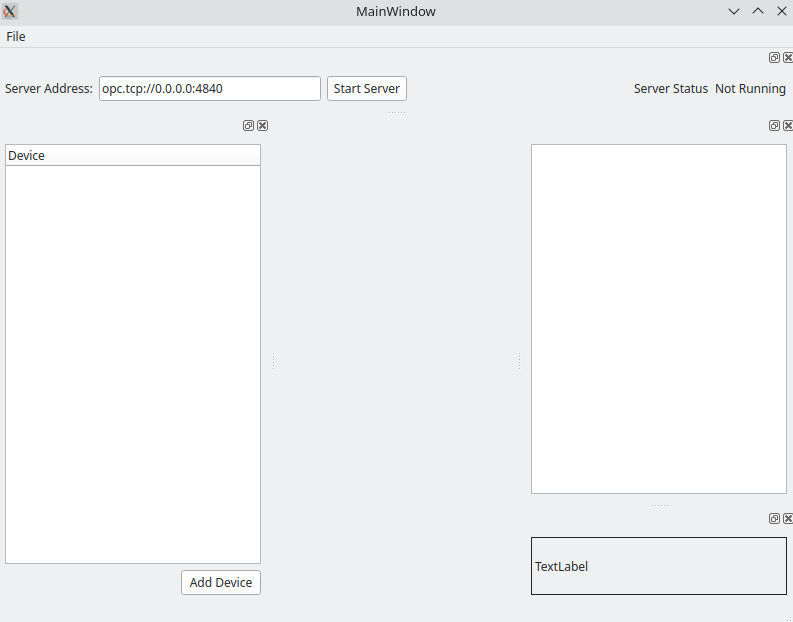
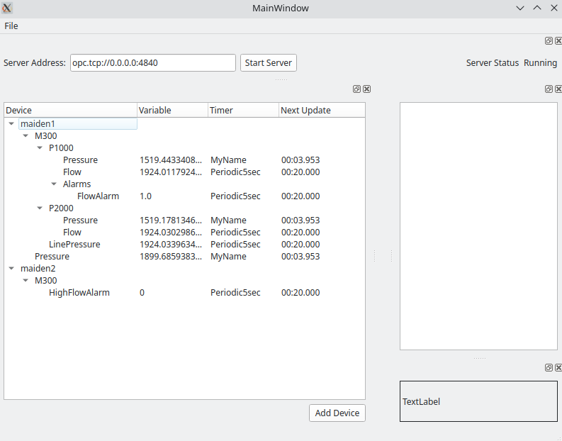
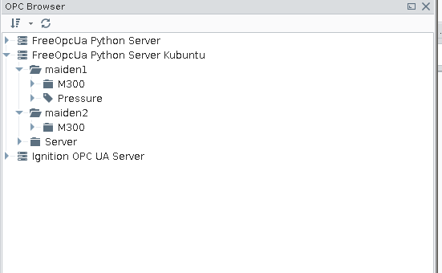
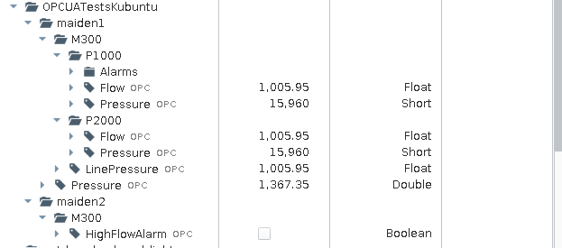

# How To Run
After all the required packages have been installed, type 
```python
python mainwindow.py
```
or
```python
python3 mainwindow.py
```
in your favorite terminal. 
# Quick Introduction
The default starting address is opc.tcp://0.0.0.0:4840. This can be easily changed by
typing a new address in the Server Address line. The program will not let you add
any devices until the server has been started.


Click "Start Server" to start the OPC UA server.
The "Server Status" will change from "Not Running" to "Running" if the server has been
stared successfully.


You can add devices by using the "File" menu item at the top and then selecting "Add
Directory" or "Add File." See the "Device XML Structure" if you'd like
to try to make your own from scratch. There is also "test_file_2.xml" in the
devices_and_timers folder as an example.

If you have successfully imported files, you should see the devices listed in the
tree on the left hand side.



If you have added the server to your Ignition Gateway, you can see it listed in 
the OPC browser.


You can drag and drop the items into your tags folder


# Timers
Each variable in the program has a timer associated with it. A timer fires either
after a set amount of time every time, called *periodic*, or a random amount of time
between give low and high values called *random.*

When a timer fires, it evaluates all functions that are associated with it.

For example, a random timer with min 2.5 and max 80, can be called at any millisecond
values between 250 ms and 80,000 ms. A periodic timer with timeout set to 2 will fire
every 2 seconds.

# Functions
Every variable has function defined for it. The following list are all the 
available functions for variables. There are plans to add more functions.

## ValueList
This function takes a list of values and then iterates through the list in order.
The function can iterate through a set number of times or indefinitely.
### Example
[1, 3, 2, 4, 6], Period = 3, Repeat = False: This would cause the variable to take 
on the values 1, 3, 2, 4, 6, 1, 3, 2, 4, 6, 1, 3, 2, 4, 6 and then stop on 6. 
Having Repeat=True discards any value period
### XML Function Element

## WeightedList
This function takes a random sample from a list created from a value and weight lists.
If the values is [v_1, v_2, ..., v_n] and the weight list is [w_1, w_2, ..., w_n], 
then the random sample is take from w_1 copies of v_1, w_2 copies of v_2, ..., 
and w_n copies of v_n. Note that the weight list must be integers.
### Example
values = [1, 4, 5] and weights = [9, 2, 1]. The random sample is taken from
[1, 1, 1, 1, 1, 1, 1, 1, 1, 4, 4, 5]. Thus the probability of 1 is 3/4, probability
of 4 is 1/6, and 5 is 1/12.
### XML Function Element
The XML function element "weightedlist" must contain:
* type = 'weightedlist'
* timer = name of timer 
* values = list of values in brackets [] (might have a different name in your 
country)
* weights = list of values in brackets [] (might have a different name in your 
country)
* period = number of times the random sample should be taken; if repeat set to 
True, random sample will be taken indefinitely
* repeat = True means repeat indefinitely, False means stop after period

## RampStep
The variable increments the same given value every time its associated timer
fires.

## RampPeriodic

## Square

## RandomSquare

## Triangle

## Sin

## Cos

# Device XML Structure
The base tag is "simulator." The sub-element "timers" contains all the definitions
for timers that are to be used for the variables.

The next sub-elements are "device." There can be 1 or many "device" sub-elements
of "simulator." Each "device" element must contain 
* name
* datatype
* timer (timer name must be listed in the timers section)
* function
The function element contains many sub-elements that depend on the function used.

# Future Plans

## Disclaimer
This still needs a lot of work. The GUI is operational and allows for adding/deleting 
devices. Being able to edit devices and such still needs some work.
